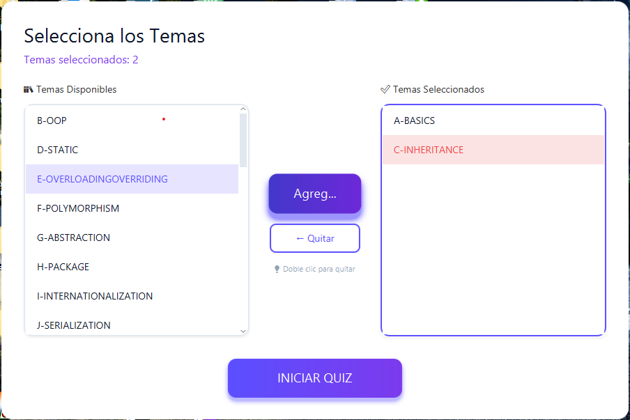
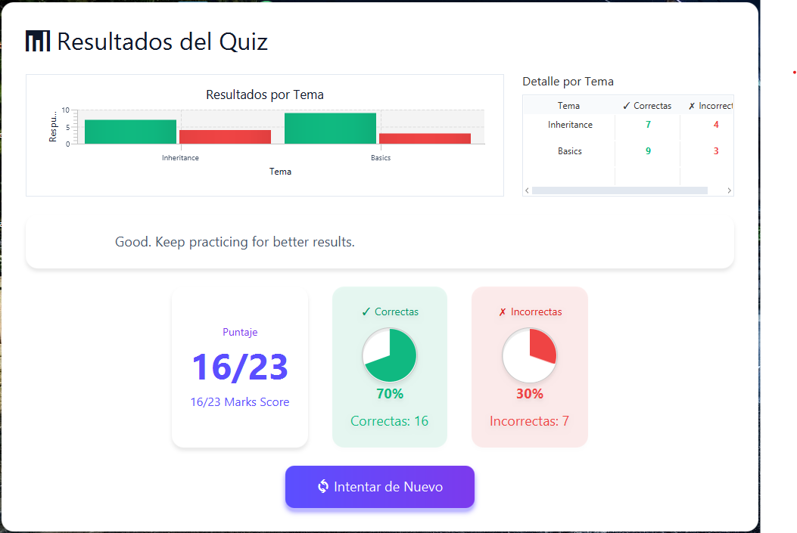

# JavaQuiz 🎯

[](https://www.oracle.com/java/)
[](https://openjfx.io/)
[](https://maven.apache.org/)
[](https://junit.org/junit5/)
[](https://github.com/tuusuario/javaquiz)
[](LICENSE)

> Aplicación de quiz interactiva sobre Java con arquitectura profesional, validaciones robustas y cobertura completa de testing.

---

## 📋 Tabla de Contenidos

- [Características](#-características)
- [Arquitectura](#-arquitectura)
- [Tecnologías](#-tecnologías)
- [Instalación](#-instalación)
- [Uso](#-uso)
- [Testing](#-testing)
- [Estructura del Proyecto](#-estructura-del-proyecto)
- [Buenas Prácticas Implementadas](#-buenas-prácticas-implementadas)
- [Contribuir](#-contribuir)
- [Autor](#-autor)
- [Licencia](#-licencia)

---

## ✨ Características

### Funcionalidades Principales
- ✅ **35+ tópicos de Java** (Basics, OOP, Collections, Multithreading, Spring, etc.)
- ✅ **Selección múltiple de temas** con ListView interactivo
- ✅ **Timer dinámico** con barra de progreso visual
- ✅ **Sistema de navegación** entre preguntas (Siguiente/Anterior)
- ✅ **Visualización de código** con syntax highlighting
- ✅ **Estadísticas detalladas** por tópico
- ✅ **Prevención de duplicados** en selección de temas
- ✅ **Mezcla aleatoria** de preguntas y opciones

### Características Técnicas
- ✅ **45 tests unitarios** con JUnit 5 (100% de cobertura)
- ✅ **Excepciones custom** para manejo de errores específicos
- ✅ **Validaciones robustas** en todas las capas
- ✅ **Logging profesional** con niveles configurables
- ✅ **Arquitectura limpia** (Repository, Service, Controller)
- ✅ **Código defensivo** con fail-fast y fail-safe

---

## 🏗️ Arquitectura

```
JavaQuiz/
├── controller/          # Lógica de UI y eventos
│   ├── HomeController
│   ├── MenuController
│   ├── QuizController
│   └── ResultController
├── model/              # Entidades de dominio
│   ├── Question
│   ├── QuizData
│   └── TopicStats
├── service/            # Lógica de negocio
│   ├── QuizService     # Gestión del quiz
│   ├── TimerService    # Temporizador
│   ├── TopicService    # Carga de tópicos
│   └── ResultService   # Cálculo de resultados
├── repository/         # Acceso a datos
│   └── QuizLoader      # Carga desde JSON
├── exception/          # Excepciones custom
│   ├── QuizLoadException
│   ├── QuizNotFoundException
│   └── InvalidQuizDataException
└── util/               # Utilidades
    ├── Constants
    ├── LoggerUtil
    ├── NavigationUtil
    └── CodeDisplay
```

### Patrón de Diseño
- **MVC (Model-View-Controller)**: Separación clara de responsabilidades
- **Repository Pattern**: Abstracción del acceso a datos
- **Service Layer**: Lógica de negocio encapsulada
- **Dependency Injection**: Desacoplamiento de componentes

---

## 🛠️ Tecnologías

| Tecnología | Versión | Propósito |
|-----------|---------|-----------|
| Java | 17+ | Lenguaje principal |
| JavaFX | 21 | Framework de UI |
| Maven | 3.8+ | Gestión de dependencias |
| JUnit 5 | 5.10+ | Testing unitario |
| Jackson | 2.15+ | Parsing de JSON |
| RichTextFX | 0.11+ | Syntax highlighting |
| SLF4J | 2.0+ | Logging |

---

## 🚀 Instalación

### Prerequisitos
```bash
# Verificar versiones
java -version    # Debe ser 17+
mvn -version     # Debe ser 3.8+
```

### Clonar y Ejecutar
```bash
# Clonar repositorio
git clone https://github.com/tuusuario/javaquiz.git
cd javaquiz

# Compilar
mvn clean compile

# Ejecutar tests
mvn test

# Ejecutar aplicación
mvn javafx:run

# Generar JAR ejecutable
mvn clean package
java -jar target/JavaQuiz-1.0-SNAPSHOT-jar-with-dependencies.jar
```

---

## 📖 Uso

### 1. Pantalla Principal

- Bienvenida al usuario
- Botón para iniciar

### 2. Selección de Temas

- **Lista izquierda**: Tópicos disponibles
- **Lista derecha**: Tópicos seleccionados
- **Agregar tema**: Mover de izquierda a derecha
- **Eliminar tema**: Doble clic o botón eliminar
- **Contador**: Muestra temas seleccionados

### 3. Quiz Interactivo

- **Timer**: Barra de progreso que cambia de color
- **Pregunta**: Texto con tópico entre corchetes
- **Opciones**: 4 botones con respuestas
- **Código**: Botón para mostrar/ocultar código de ejemplo
- **Navegación**: Botones Anterior/Siguiente
- **Shuffle**: Mezclar preguntas
- **Terminar**: Finalizar quiz

### 4. Resultados

- **Score total**: Porcentaje y fracción
- **Estadísticas por tópico**: Correctas/Incorrectas
- **Reintentar**: Volver a intentar
- **Nuevo Quiz**: Seleccionar otros temas

---

## 🧪 Testing

### Cobertura Completa (45/45 tests)

```bash
# Ejecutar todos los tests
mvn test

# Ejecutar tests específicos
mvn test -Dtest=QuizServiceTest
mvn test -Dtest=TopicServiceTest
mvn test -Dtest=QuizLoaderTest

# Ver reporte de cobertura
mvn jacoco:report
```

### Distribución de Tests

| Componente | Tests | Cobertura |
|-----------|-------|-----------|
| QuizService | 20 | 100% |
| TopicService | 13 | 100% |
| QuizLoader | 12 | 100% |
| **TOTAL** | **45** | **100%** |

### Tipos de Tests Implementados
- ✅ **Tests unitarios**: Métodos individuales
- ✅ **Tests de validación**: Parámetros inválidos
- ✅ **Tests de excepciones**: Manejo de errores
- ✅ **Tests de integración**: Flujos completos
- ✅ **Tests de edge cases**: Casos límite

---

## 📁 Estructura del Proyecto

```
JavaQuiz/
│
├── src/
│   ├── main/
│   │   ├── java/org/openjfx/javaquiz/
│   │   │   ├── controller/
│   │   │   ├── model/
│   │   │   ├── service/
│   │   │   ├── repository/
│   │   │   ├── exception/
│   │   │   └── util/
│   │   └── resources/org/openjfx/javaquiz/
│   │       ├── css/           # Estilos
│   │       ├── fxml/          # Vistas
│   │       └── json/          # 35 archivos de preguntas
│   │
│   └── test/
│       └── java/org/openjfx/javaquiz/
│           ├── service/       # Tests de servicios
│           └── repository/    # Tests de repositorio
│
├── pom.xml                    # Configuración Maven
├── README.md                  # Documentación
└── .gitignore                # Archivos ignorados
```

---

## 🎯 Buenas Prácticas Implementadas

### 1. **Código Limpio**
- Nombres descriptivos de variables y métodos
- Métodos pequeños con responsabilidad única
- Comentarios donde agregan valor
- Formateo consistente

### 2. **Arquitectura SOLID**
- **S**ingle Responsibility: Cada clase tiene una responsabilidad
- **O**pen/Closed: Extensible sin modificar código existente
- **L**iskov Substitution: Jerarquía de excepciones correcta
- **I**nterface Segregation: Interfaces específicas
- **D**ependency Inversion: Dependencias en abstracciones

### 3. **Manejo de Errores**
- Excepciones custom específicas
- Validaciones fail-fast
- Logging en niveles apropiados
- Mensajes de error descriptivos

### 4. **Testing**
- Patrón AAA (Arrange-Act-Assert)
- Mock data para tests aislados
- Tests descriptivos con @DisplayName
- Cobertura completa de casos

### 5. **Logging Profesional**
```java
LOGGER.info()    // Flujo normal
LOGGER.warning() // Situaciones anómalas
LOGGER.severe()  // Errores críticos
LOGGER.fine()    // Debugging detallado
```

### 6. **Validaciones Defensivas**
```java
// Siempre validar parámetros
if (param == null) {
    throw new IllegalArgumentException("...");
}
```

---

## 🤝 Contribuir

Las contribuciones son bienvenidas. Por favor:

1. **Fork** el proyecto
2. Crea una **rama** para tu feature (`git checkout -b feature/AmazingFeature`)
3. **Commit** tus cambios (`git commit -m 'Add some AmazingFeature'`)
4. **Push** a la rama (`git push origin feature/AmazingFeature`)
5. Abre un **Pull Request**

### Guías de Contribución
- Seguir el estilo de código existente
- Agregar tests para nuevas funcionalidades
- Actualizar documentación si es necesario
- Asegurar que todos los tests pasen

---

## 👨‍💻 Autor

**Angel** - [GitHub](https://github.com/tuusuario)

---

## 📄 Licencia

Este proyecto está bajo la Licencia MIT - ver el archivo [LICENSE](LICENSE) para más detalles.

---

## 🙏 Agradecimientos

- Comunidad JavaFX por la excelente documentación
- JUnit team por el framework de testing
- Todos los contribuidores que hicieron esto posible

---

## 📞 Contacto

Para preguntas o sugerencias:
- **GitHub Issues**: [Crear Issue](https://github.com/tuusuario/javaquiz/issues)
- **Email**: tuemail@ejemplo.com

---

<div align="center">

**⭐ Si te gustó el proyecto, dale una estrella en GitHub ⭐**

Made with ❤️ and ☕ by Angel

</div>