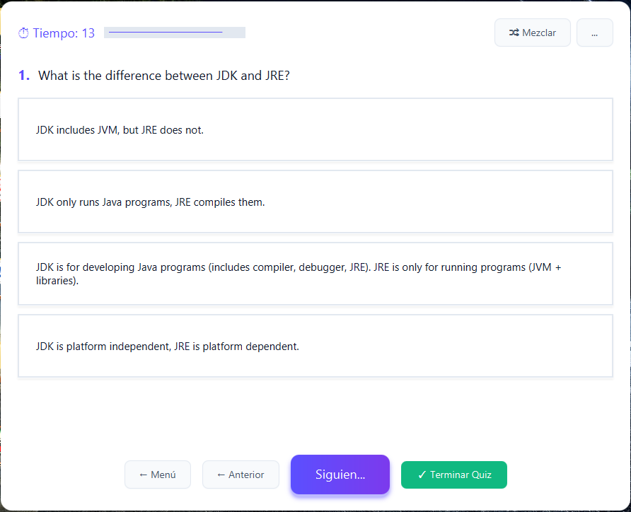

# JavaQuiz 🎯

[](https://www.oracle.com/java/)
[](https://openjfx.io/)
[](https://maven.apache.org/)
[](https://junit.org/junit5/)
[](https://github.com/angeldbd/javaquiz)
[](LICENSE)

> Aplicación de quiz interactiva sobre Java con arquitectura profesional MVC, Design System moderno, cobertura completa de testing y más de 35 temas de Java y tecnologías relacionadas.

---

## 📋 Tabla de Contenidos

- [Características](#-características)
- [Screenshots](#-screenshots)
- [Arquitectura](#-arquitectura)
- [Tecnologías](#-tecnologías)
- [Design System](#-design-system)
- [Instalación](#-instalación)
- [Uso](#-uso)
- [Testing](#-testing)
- [Estructura del Proyecto](#-estructura-del-proyecto)
- [Buenas Prácticas](#-buenas-prácticas-implementadas)
- [Known Limitations](#-known-limitations)
- [Roadmap](#-roadmap)
- [Contribuir](#-contribuir)
- [Autor](#-autor)
- [Licencia](#-licencia)

---

## ✨ Características

### Funcionalidades Principales
- ✅ **35+ tópicos de Java** (Basics, OOP, Collections, Multithreading, Spring, Hibernate, AWS, Docker, Microservices, etc.)
- ✅ **Selección múltiple de temas** con ListView interactivo y contador
- ✅ **Timer dinámico** con barra de progreso visual que cambia de color
- ✅ **Sistema de navegación** entre preguntas (Siguiente/Anterior/Mezclar)
- ✅ **Visualización de código** con syntax highlighting (RichTextFX)
- ✅ **Estadísticas detalladas** por tópico con gráficos y tablas
- ✅ **Prevención de duplicados** en selección de temas
- ✅ **Mezcla aleatoria** de preguntas y opciones
- ✅ **Animaciones sutiles** (fade in/out, pop effects)

### Características Técnicas
- ✅ **45 tests unitarios** con JUnit 5 (100% de cobertura en servicios)
- ✅ **Excepciones custom** para manejo de errores específicos
- ✅ **Validaciones robustas** en todas las capas (fail-fast y fail-safe)
- ✅ **Logging profesional** con niveles configurables (LoggerUtil)
- ✅ **Arquitectura limpia** (MVC + Repository + Service Layer)
- ✅ **Design System moderno** con paleta de colores consistente
- ✅ **Código defensivo** con validaciones en todos los métodos públicos
- ✅ **Documentación completa** (JavaDoc + API.md + DESIGN_GUIDE.md)

---

## 📸 Screenshots

### 🏠 Pantalla de Inicio


*Pantalla principal con animación de entrada y botón con gradiente moderno.*

---

### 📋 Selección de Temas


*Interfaz de selección múltiple con dos listas lado a lado. Lista izquierda muestra temas disponibles, lista derecha muestra temas seleccionados. Incluye contador de temas y botones para agregar/quitar.*

**Características visuales:**
- Cards con bordes redondeados
- Hover effects en las listas
- Iconos visuales (📚 ✅)
- Botones con estados hover

---

### 🎯 Quiz Interactivo


*Pantalla de preguntas con timer visual, opciones de respuesta estilizadas y navegación completa.*

**Características visuales:**
- Timer con icono ⏱ y barra de progreso que cambia de color
- Botones de opciones con estados (normal/hover/correcto/incorrecto)
- ScrollPane para visualización de código
- Navegación con botones diferenciados por color

---

### 📊 Resultados Detallados


*Estadísticas completas con gráfico de barras, tabla por tema y progress indicators circulares.*

**Características visuales:**
- Gráfico de barras (verde=correctas, rojo=incorrectas)
- Tabla con detalle por tema
- Cards con estadísticas (Puntaje, Correctas, Incorrectas)
- Progress indicators circulares con porcentajes
- Mensaje de feedback personalizado

---

## 🏗️ Arquitectura

### Diagrama de Capas

```
┌─────────────────────────────────────┐
│         PRESENTATION LAYER          │
│  (Controllers + FXML Views + CSS)   │
├─────────────────────────────────────┤
│         SERVICE LAYER               │
│  (Business Logic + Validations)     │
├─────────────────────────────────────┤
│         REPOSITORY LAYER            │
│  (Data Access + JSON Loading)       │
├─────────────────────────────────────┤
│         MODEL LAYER                 │
│  (Domain Entities)                  │
└─────────────────────────────────────┘
```

### Estructura de Componentes

```
JavaQuiz/
├── controller/          # Lógica de UI y eventos
│   ├── HomeController      # Pantalla inicial
│   ├── MenuController      # Selección de temas
│   ├── QuizController      # Lógica del quiz
│   └── ResultController    # Visualización de resultados
│
├── model/              # Entidades de dominio
│   ├── Question           # Pregunta con opciones
│   ├── QuizData           # Conjunto de preguntas
│   └── TopicStats         # Estadísticas por tema
│
├── service/            # Lógica de negocio
│   ├── QuizService        # Gestión del quiz (core)
│   ├── TimerService       # Temporizador con bindings
│   ├── TopicService       # Carga de tópicos
│   └── ResultService      # Cálculo de resultados
│
├── repository/         # Acceso a datos
│   └── QuizLoader         # Carga desde JSON
│
├── exception/          # Excepciones custom
│   ├── QuizLoadException
│   ├── QuizNotFoundException
│   └── InvalidQuizDataException
│
└── util/               # Utilidades
    ├── Constants          # Constantes de la aplicación
    ├── LoggerUtil         # Logging centralizado
    ├── NavigationUtil     # Navegación entre vistas
    ├── CodeDisplay        # Syntax highlighting
    └── AnimationUtil      # Animaciones reutilizables
```

### Patrones de Diseño
- **MVC (Model-View-Controller)**: Separación clara de responsabilidades
- **Repository Pattern**: Abstracción del acceso a datos
- **Service Layer**: Lógica de negocio encapsulada
- **Singleton**: LoggerUtil para logging centralizado
- **Observer Pattern**: Bindings de JavaFX para actualización automática de UI

---

## 🛠️ Tecnologías

| Tecnología | Versión | Propósito |
|-----------|---------|-----------|
| **Java** | 17+ | Lenguaje principal |
| **JavaFX** | 21 | Framework de UI |
| **Maven** | 3.8+ | Gestión de dependencias |
| **JUnit 5** | 5.10+ | Testing unitario |
| **Mockito** | 5.7.0+ | Mocking para tests |
| **Jackson** | 2.15+ | Parsing de JSON |
| **RichTextFX** | 0.11+ | Syntax highlighting |
| **SLF4J** | 2.0+ | Logging |

---

## 🎨 Design System

### Paleta de Colores

#### Colores Primarios
- **Primary**: `#5B4FFF` (Azul eléctrico) - Botones principales, títulos
- **Secondary**: `#7C3AED` (Morado) - Gradientes, elementos complementarios

#### Colores Semánticos
- **Success**: `#10B981` (Verde) - Respuestas correctas
- **Error**: `#EF4444` (Rojo) - Respuestas incorrectas
- **Warning**: `#F59E0B` (Naranja) - Advertencias

#### Colores Neutrales
- **Background**: `#FFFFFF` (Blanco)
- **Text Primary**: `#0F172A` (Casi negro)
- **Text Secondary**: `#475569` (Gris oscuro)

### Componentes CSS

#### Botones
- `.btn-primary` - Gradiente azul-morado, acción principal
- `.btn-secondary` - Borde azul, acción secundaria
- `.btn-nav` - Gris claro, navegación
- `.btn-finish` - Verde, finalizar quiz

#### Opciones del Quiz
- `.option-button` - Estado normal (blanco con borde)
- `.option-correct` - Respuesta correcta (verde)
- `.option-wrong` - Respuesta incorrecta (rojo)

#### Contenedores
- `.container-main` - Contenedor principal con esquinas redondeadas
- `.stats-card` - Tarjeta de estadísticas

Ver [DESIGN_GUIDE.md](DESIGN_GUIDE.md) para documentación completa del Design System.

---

## 🚀 Instalación

### Prerequisitos
```bash
# Verificar versiones
java -version    # Debe ser 17+
mvn -version     # Debe ser 3.8+
```

### Clonar y Ejecutar
```bash
# Clonar repositorio
git clone https://github.com/angeldbd/javaquiz.git
cd javaquiz

# Compilar
mvn clean compile

# Ejecutar tests
mvn test

# Ejecutar aplicación
mvn javafx:run

# Generar JAR ejecutable
mvn clean package
java -jar target/JavaQuiz-1.0-SNAPSHOT-jar-with-dependencies.jar
```

---

## 📖 Uso

### Flujo de Usuario

1. **Inicio** → Clic en "COMENZAR QUIZ" (animación fade out)
2. **Selección** → Elegir uno o varios temas de la lista
3. **Agregar** → Botón "Agregar →" para mover temas
4. **Iniciar Quiz** → Botón "INICIAR QUIZ"
5. **Responder** → Seleccionar respuestas (feedback visual inmediato)
6. **Navegación** → Usar botones Anterior/Siguiente/Mezclar
7. **Resultados** → Ver estadísticas detalladas con gráficos
8. **Reintentar** → Botón "🔄 Intentar de Nuevo"

### Atajos y Tips
- **Doble clic** en tema seleccionado → Lo quita de la lista
- **Botón "🔀 Mezclar"** → Aleatoriza orden de preguntas
- **Botón "Ver Código"** → Muestra snippets cuando disponible
- **Timer** → Cambia color según tiempo (azul→naranja→rojo)
- **Navegación** → Permite revisar respuestas anteriores

---

## 🧪 Testing

### Cobertura Completa (45/45 tests ✅)

```bash
# Ejecutar todos los tests
mvn test

# Tests específicos
mvn test -Dtest=QuizServiceTest
mvn test -Dtest=TopicServiceTest
mvn test -Dtest=QuizLoaderTest

# Reporte de cobertura
mvn jacoco:report
```

### Distribución de Tests

| Componente | Tests | Cobertura | Líneas |
|-----------|-------|-----------|--------|
| **QuizService** | 20 | 100% | 250+ |
| **TopicService** | 13 | 100% | 180+ |
| **QuizLoader** | 12 | 100% | 150+ |
| **TOTAL** | **45** | **100%** | **580+** |

### Tipos de Tests Implementados

#### Tests Unitarios
```java
@Test
@DisplayName("Debe cargar correctamente preguntas desde JSON")
void testLoadQuestions() {
    // Arrange - Act - Assert
}
```

#### Tests de Validación
```java
@Test
@DisplayName("Debe lanzar excepción con tema null")
void testNullTopic() {
    assertThrows(IllegalArgumentException.class, () -> {
        service.loadTopic(null);
    });
}
```

#### Tests de Integración
```java
@Test
@DisplayName("Flujo completo: cargar múltiples temas")
void testFullFlow() {
    // Test end-to-end
}
```

---

## 📁 Estructura del Proyecto

```
JavaQuiz/
│
├── docs/
│   ├── javadoc/              # Documentación API
│   └── screenshots/          # Capturas de pantalla
│       ├── home.png
│       ├── menu.png
│       ├── quiz.png
│       └── results.png
│
├── src/
│   ├── main/
│   │   ├── java/org/openjfx/javaquiz/
│   │   │   ├── controller/
│   │   │   ├── model/
│   │   │   ├── service/
│   │   │   ├── repository/
│   │   │   ├── exception/
│   │   │   └── util/
│   │   └── resources/org/openjfx/javaquiz/
│   │       ├── css/           # Estilos (JavaQuiz.css, javaCodePane.css)
│   │       ├── fxml/          # Vistas (4 archivos)
│   │       └── json/          # 35 archivos de preguntas
│   │
│   └── test/
│       └── java/org/openjfx/javaquiz/
│           └── service/       # 45 tests unitarios
│
├── pom.xml                    # Configuración Maven
├── README.md                  # Este archivo
├── API.md                     # Documentación de API
├── DESIGN_GUIDE.md            # Guía del Design System
└── .gitignore                # Archivos ignorados por Git
```

---

## 🎯 Buenas Prácticas Implementadas

### 1. Código Limpio
- ✅ Nombres descriptivos de variables y métodos
- ✅ Métodos pequeños con responsabilidad única (SRP)
- ✅ Comentarios donde agregan valor
- ✅ Formateo consistente (4 espacios de indentación)

### 2. Principios SOLID

#### Single Responsibility
```java
// QuizService → Solo gestiona la lógica del quiz
// TimerService → Solo gestiona el temporizador
// TopicService → Solo gestiona la carga de temas
```

#### Open/Closed
```java
// Extensible sin modificar código existente
// Nuevos temas → Solo agregar JSON, sin cambiar código
```

#### Liskov Substitution
```java
// Jerarquía de excepciones correcta
QuizException
├── QuizLoadException
├── QuizNotFoundException
└── InvalidQuizDataException
```

#### Interface Segregation
```java
// Interfaces específicas, no interfaces gordas
// Cada servicio tiene su responsabilidad clara
```

#### Dependency Inversion
```java
// Controladores dependen de Servicios (abstracción)
// No dependen de implementaciones concretas
```

### 3. Manejo de Errores

#### Excepciones Custom
```java
public class QuizLoadException extends Exception {
    public QuizLoadException(String topic, Throwable cause) {
        super("Error loading quiz for topic: " + topic, cause);
    }
}
```

#### Validaciones Fail-Fast
```java
public void loadTopic(String topic) {
    if (topic == null || topic.isBlank()) {
        throw new IllegalArgumentException("Topic cannot be null or blank");
    }
    // Resto del código
}
```

#### Logging Apropiado
```java
LOGGER.info("Quiz started with {} topics", topicCount);
LOGGER.warning("Invalid data found in topic: {}", topic);
LOGGER.severe("Critical error loading quiz", exception);
```

### 4. Testing Profesional

#### Patrón AAA (Arrange-Act-Assert)
```java
@Test
void testExample() {
    // Arrange
    QuizService service = new QuizService();
    
    // Act
    int result = service.calculate();
    
    // Assert
    assertEquals(10, result);
}
```

#### Tests Descriptivos
```java
@DisplayName("Debe cargar correctamente un archivo JSON válido")
@Test
void testLoadValidJson() {
    // Test implementation
}
```

### 5. Documentación

#### JavaDoc Completo
```java
/**
 * Carga un quiz desde un archivo JSON.
 * 
 * @param topic El nombre del tópico a cargar
 * @return QuizData con las preguntas cargadas
 * @throws QuizLoadException si el archivo no se puede cargar
 * @throws QuizNotFoundException si el archivo no existe
 */
public QuizData load(String topic) throws QuizLoadException {
    // Implementation
}
```

---

## 🐛 Known Limitations

### Limitaciones Actuales

1. **BarChart con muchos temas**
   - El gráfico de barras puede verse comprimido cuando se seleccionan más de 10 temas simultáneamente
   - **Workaround**: Se recomienda seleccionar máximo 8-10 temas para mejor visualización
   - **Futuro**: Implementar scroll horizontal o cambiar a otro tipo de visualización

2. **Tamaños de ventana fijos**
   - Las ventanas tienen tamaños predefinidos y no son responsive
   - **Razón**: Cada pantalla tiene necesidades específicas de espacio
   - **Futuro**: Implementar layouts responsive con Media Queries

### Reportar Issues

Si encuentras otros bugs:

1. Revisa los [Issues existentes](https://github.com/angeldbd/javaquiz/issues)
2. Crea un nuevo issue con:
   - Descripción del problema
   - Pasos para reproducir
   - Comportamiento esperado vs actual
   - Screenshots si aplica
   - Logs de error (check `logs/` folder)

---

## 🚀 Roadmap

### Versión Actual: 2.0 ✅

- [x] Arquitectura MVC completa
- [x] Sistema de logging profesional
- [x] 45 tests unitarios (100% cobertura)
- [x] Design System moderno
- [x] Animaciones sutiles
- [x] 35+ temas de Java
- [x] Documentación completa (JavaDoc + guides)

### Futuras Mejoras (v2.1) 🔜

- [ ] **Dark Mode** - Tema oscuro alternativo
- [ ] **Exportar resultados a PDF** - Guardar estadísticas
- [ ] **Historial de quizzes** - Ver quizzes anteriores
- [ ] **Modo práctica** - Sin timer, para estudiar
- [ ] **Gráficos responsive** - Scroll horizontal en BarChart

### Futuras Mejoras (v3.0) 🌟

- [ ] **Base de datos** - Persistencia con SQLite/H2
- [ ] **Sistema de usuarios** - Login y perfiles
- [ ] **Crear quizzes custom** - Editor de preguntas
- [ ] **Compartir resultados** - Export a imagen/social
- [ ] **Modo multijugador** - Competir en tiempo real

---

## 🤝 Contribuir

Las contribuciones son bienvenidas. Por favor:

1. **Fork** el proyecto
2. Crea una **rama** para tu feature (`git checkout -b feature/AmazingFeature`)
3. **Commit** tus cambios (`git commit -m 'feat: add AmazingFeature'`)
4. **Push** a la rama (`git push origin feature/AmazingFeature`)
5. Abre un **Pull Request**

### Guías de Contribución

- ✅ Seguir el estilo de código existente
- ✅ Agregar tests para nuevas funcionalidades
- ✅ Actualizar documentación (JavaDoc + README)
- ✅ Asegurar que todos los tests pasen (`mvn test`)
- ✅ Usar Conventional Commits (`feat:`, `fix:`, `docs:`, etc.)

### Convenciones de Commits

```bash
feat: nueva funcionalidad
fix: corrección de bug
docs: cambios en documentación
style: cambios de formato (CSS, espaciado)
refactor: refactorización de código
test: agregar o modificar tests
chore: cambios en build, dependencias
```

---

## 👨‍💻 Autor

**Angel** - [GitHub](https://github.com/angeldbd)

---

## 📄 Licencia

Este proyecto está bajo la Licencia MIT - ver el archivo [LICENSE](LICENSE) para más detalles.

```
MIT License

Copyright (c) 2025 Angel

Permission is hereby granted, free of charge, to any person obtaining a copy
of this software and associated documentation files (the "Software"), to deal
in the Software without restriction, including without limitation the rights
to use, copy, modify, merge, publish, distribute, sublicense, and/or sell
copies of the Software, and to permit persons to whom the Software is
furnished to do so, subject to the following conditions:

The above copyright notice and this permission notice shall be included in all
copies or substantial portions of the Software.

THE SOFTWARE IS PROVIDED "AS IS", WITHOUT WARRANTY OF ANY KIND, EXPRESS OR
IMPLIED, INCLUDING BUT NOT LIMITED TO THE WARRANTIES OF MERCHANTABILITY,
FITNESS FOR A PARTICULAR PURPOSE AND NONINFRINGEMENT. IN NO EVENT SHALL THE
AUTHORS OR COPYRIGHT HOLDERS BE LIABLE FOR ANY CLAIM, DAMAGES OR OTHER
LIABILITY, WHETHER IN AN ACTION OF CONTRACT, TORT OR OTHERWISE, ARISING FROM,
OUT OF OR IN CONNECTION WITH THE SOFTWARE OR THE USE OR OTHER DEALINGS IN THE
SOFTWARE.
```

---

## 🙏 Agradecimientos

- Comunidad JavaFX por la excelente documentación
- OpenJFX por mantener JavaFX actualizado
- JUnit team por el framework de testing
- Todos los que contribuyeron con preguntas para los quizzes

---

## 📞 Contacto

Para preguntas o sugerencias:
- **GitHub**: [@angeldbd](https://github.com/angeldbd)
- **Issues**: [Crear Issue](https://github.com/angeldbd/javaquiz/issues)
- **Email**: angel_latinp@hotmail.com

---

## 📚 Documentación Adicional

- **[JavaDoc](docs/javadoc/index.html)** - Documentación completa de la API
- **[API.md](API.md)** - Guía rápida de clases y métodos
- **[DESIGN_GUIDE.md](DESIGN_GUIDE.md)** - Guía completa del Design System

---

<div align="center">

**⭐ Si te gustó el proyecto, dale una estrella en GitHub ⭐**

Made with ❤️ and ☕ by Angel


</div>